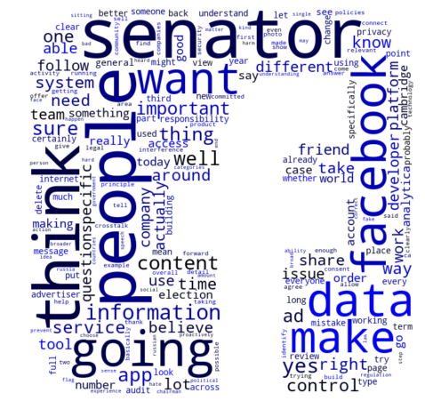

```python
%matplotlib inline
# -*- coding: utf-8 -*-
"""
Created on Fri Apr 20 10:58:43 2018

@author: bsuzow

This purpose of this project is to identify most spoken words by FB's CEO during the congressional hearings in April 10 & 11, 2018.

- Web scraping
- Textual data transformation/load
- Wordcloud creation

"""
def hearing_text_output(word_list_tuple):
    """
    Draws a word cloud
    Plots frequently said words
    Argument:
        word_list_tuple: a tuple of two objs of work tokens
            [0]: word tokens in a list obj
            [1]: word frequency distribution obj
    Return value:
        most frequenly shown word tokens in list
    """
    # Wordcloud
    text_in_string = " ".join(word_list_tuple[0])  # convert to string
    WC = word_cloud(text_in_string)  
    
    freq_words = word_list_tuple[1].most_common()
    # Plot
    word_list_tuple[1].plot(30)
    #word_list_tuple[1].plot(50, cumulative=True)
    
    return freq_words

""" 
Main begins
""" 
from FB_Hearing_Wscraping import Read_HTML
from FB_Text_Processing import Tokenize
from FB_WordCloud import word_cloud

url_0410 = "https://www.washingtonpost.com/news/the-switch/wp/2018/04/10/transcript-of-mark-zuckerbergs-senate-hearing/?utm_term=.3a46cd6da4a1"

url_0411 = "https://www.washingtonpost.com/news/the-switch/wp/2018/04/11/transcript-of-zuckerbergs-appearance-before-house-committee/?utm_term=.300276ffbe68"
p_0410_hearing = Read_HTML(url_0410,1)
p_0411_hearing = Read_HTML(url_0411,2) # partial transcript

# confirm the number of elements in zuckerberg's remarks
len(p_0410_hearing[1]) 
len(p_0411_hearing[1]) 

# Day1 Hearing
# tokenize word tokens and draw a word cloud
Day1 = Tokenize(p_0410_hearing[1],1)
FB_WC1 = hearing_text_output(Day1)

# Day2 Hearing
Day2 = Tokenize(p_0411_hearing[1],2)
FB_WC2 = hearing_text_output(Day2)

"""
End of main
"""

```

    
    Day1 Hearing:
    
      total number of tokens: 21608
      total number of unique words or punctuations: 1821
      lexical diversity: 0.08427434283598667
    
    





    
    Day2 Hearing:
    
      total number of tokens: 19144
      total number of unique words or punctuations: 1672
      lexical diversity: 0.0873380693689929
    
    


    '\nEnd of main\n'


